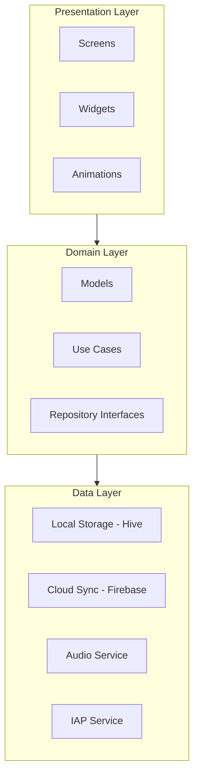
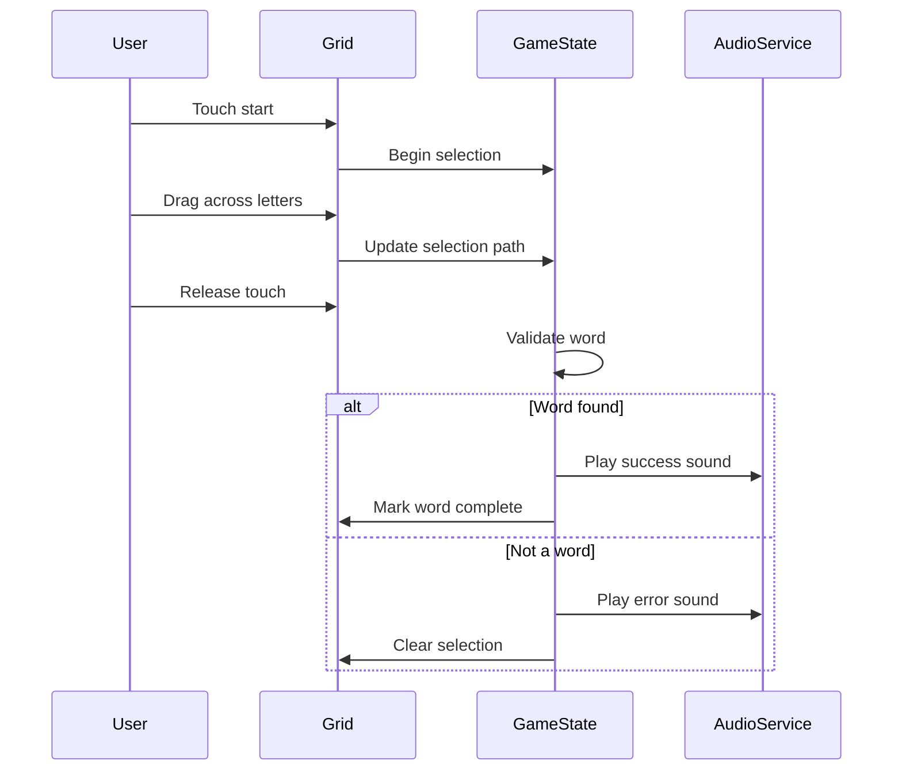

# Word Search Game - Flutter Implementation Plan

## Summary of Requirements

| Feature | Selection ||---------|-----------|| Platforms | iOS (iPhone + iPad), Web || Word Directions | All 8 (horizontal, vertical, diagonal + reverses) || Difficulty | Easy (8x8), Medium (12x12), Hard (15x15) || Game Modes | Casual, Timed, Daily Puzzle || Word Source | Built-in themed categories || Theme | Playful / Colorful with animations || Hints | Reveal first letter, Highlight word (limited per puzzle) || Storage | Local + Cloud sync with accounts || Scoring | Time tracking, Streaks, Leaderboards, Achievements, Stats || Categories | Animals, Food, Countries, Sports, Nature, Science, Movies, Holidays || Monetization | In-app purchases (hints, themes, categories) || Audio | Sound effects + background music |---

## Architecture



---

## Project Structure

```javascript
lib/
├── main.dart
├── app.dart
├── core/
│   ├── constants/
│   ├── theme/
│   ├── utils/
│   └── extensions/
├── features/
│   ├── game/
│   │   ├── data/
│   │   │   ├── models/
│   │   │   ├── repositories/
│   │   │   └── datasources/
│   │   ├── domain/
│   │   │   ├── entities/
│   │   │   ├── repositories/
│   │   │   └── usecases/
│   │   └── presentation/
│   │       ├── screens/
│   │       ├── widgets/
│   │       ├── providers/
│   │       └── animations/
│   ├── daily_puzzle/
│   ├── settings/
│   ├── stats/
│   ├── leaderboard/
│   ├── achievements/
│   └── auth/
├── services/
│   ├── audio_service.dart
│   ├── iap_service.dart
│   └── analytics_service.dart
└── data/
    └── word_lists/
        ├── animals.dart
        ├── food.dart
        └── ... (other categories)
```

---

## Key Dependencies

| Package | Purpose ||---------|---------|| `flutter_riverpod` | State management || `hive_flutter` | Local storage || `firebase_core`, `firebase_auth`, `cloud_firestore` | Cloud sync + auth || `in_app_purchase` | Monetization || `audioplayers` | Sound effects + music || `go_router` | Navigation || `freezed` + `json_serializable` | Immutable models || `flutter_animate` | Playful animations |---

## Core Game Logic

### Grid Generation Algorithm

1. Create empty NxN grid based on difficulty
2. For each word in the puzzle:

- Pick random direction (8 options)
- Find valid starting positions
- Place word if it fits (can overlap on matching letters)

3. Fill remaining cells with random letters
4. Store word positions for validation

### Touch/Selection System



---

## Screens

1. **Home** - Mode selection, daily puzzle banner, stats preview
2. **Category Select** - Grid of themed categories with lock states for IAP
3. **Difficulty Select** - Easy/Medium/Hard with grid previews
4. **Game** - Main puzzle grid, word list, timer, hints, pause
5. **Pause Menu** - Resume, restart, settings, quit
6. **Results** - Time, score, achievements unlocked, share
7. **Daily Puzzle** - Calendar view, streak display
8. **Stats** - Personal statistics, graphs
9. **Leaderboard** - Global/Friends rankings
10. **Achievements** - Badge collection with progress
11. **Settings** - Sound, music, theme, account, restore purchases
12. **Auth** - Sign in/up for cloud sync

---

## Data Models

```dart
// Core game entities
class Puzzle { grid, words, difficulty, category, timeLimit }
class Word { text, startPos, endPos, direction, isFound }
class GameSession { puzzle, foundWords, elapsedTime, hintsUsed, score }
class UserProfile { id, displayName, stats, achievements, purchases }
class DailyPuzzle { date, puzzle, completed, streak }
```

---

## Implementation Phases

### Phase 1: Foundation

- Flutter project setup with platform configs
- Core theme system (playful colors, typography, spacing)
- Navigation structure with go_router
- Base widget library (buttons, cards, grid cell)

### Phase 2: Core Game

- Grid generation algorithm
- Touch selection system
- Word validation
- Game state management with Riverpod
- Basic game screen UI

### Phase 3: Game Modes

- Casual mode (untimed)
- Timed mode with countdown
- Difficulty levels (grid sizes)
- Category system with word lists

### Phase 4: Persistence

- Hive local storage setup
- Game progress saving
- Stats tracking
- Settings persistence

### Phase 5: Daily Puzzle

- Daily puzzle generation (seeded random)
- Streak system
- Calendar view

### Phase 6: Cloud Sync

- Firebase setup
- Authentication (email, Apple, Google)
- Cloud Firestore for user data
- Cross-device sync

### Phase 7: Scoring System

- Leaderboards (Firebase)
- Achievements system
- Stats dashboard

### Phase 8: Monetization

- In-app purchase setup
- Premium categories
- Hint packs
- Ad removal option (if adding ads later)

### Phase 9: Audio

- Sound effects integration
- Background music
- Audio settings

### Phase 10: Polish

- Animations (word found, level complete, achievements)